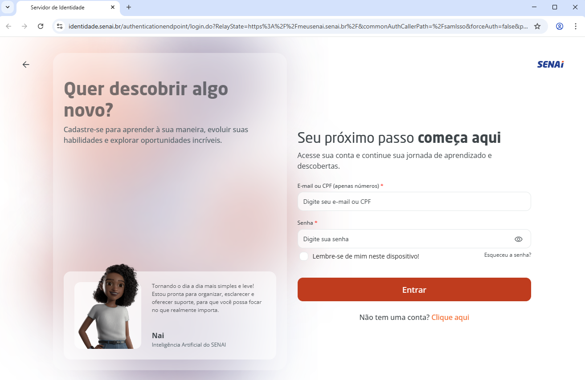
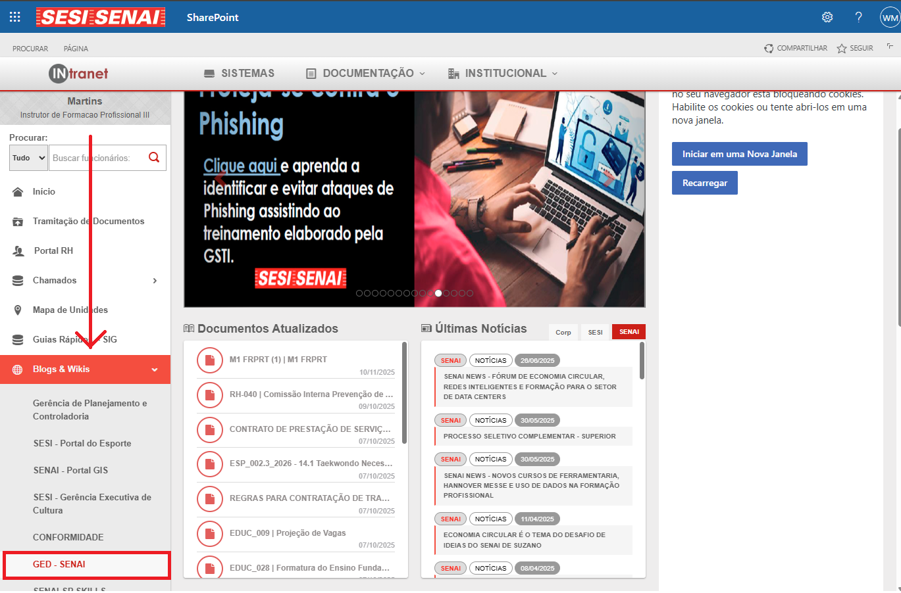
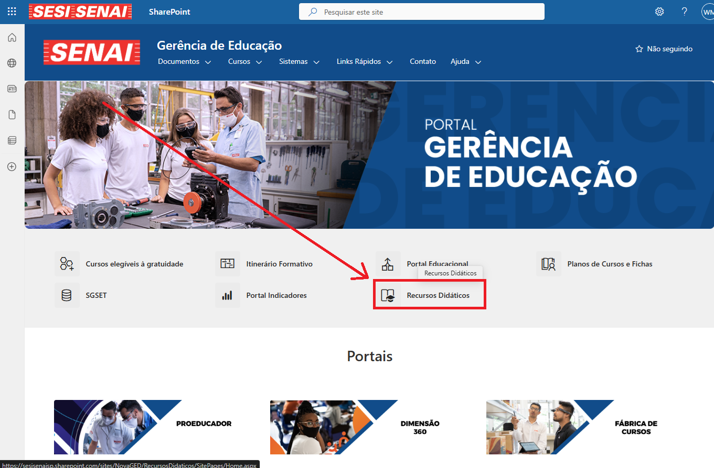
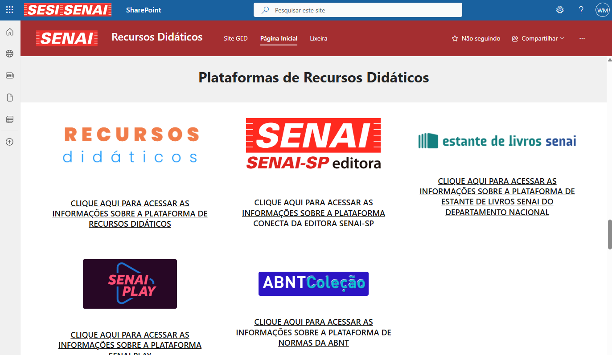

# Meu SENAI
Acesso com seu e-mail institucional (@docente.senai.br).

## [meusenai.senai.br](https://meusenai.senai.br/)

## [SGSET](https://sgset.sp.senai.br/)
Quando uma nova turma é cadastrada no sistema, se avivar a opção `[x] Meu senai`, automaticamente é criada uma sala no **Google Classroom**. O docente receberá um e-mail no endereço (@docente.senai.br) de notificação com o link da sala.

## Plataformas SENAI para acesso a conteúdos digitais

Para acesso a todos os recursos siga os passos (Intranet SENAI, Menu lateral **Blogs & Wikis**, **GED - SENAI** (Na página vá até o link **Recursos Didáticos**) Rolar a página até o fim.
 
 

## Coletânea de links das principais plataformas
- Biblioteca SP - [Conecta SENAI](https://www.conectasenai.com.br/login/), passo a passo [para acessar](./assets/conecta-passo-a-passo.pdf).
- Biblioteca DN - [Estante de livros](https://estantedelivros.senai.br/), conhecendo a [plataforma](https://www.youtube.com/watch?v=DUiEZzhOees).
- [Recursos Didáticos](https://recursosdidaticos.senai.br/), passo a passo [para acessar](https://www.youtube.com/watch?v=sjmQ3Y9a7-A&list=PLPli_KFbLinFjpj4T8VBoZVUwWnPi4jyd).
- [SENAI Play](https://play.senai.br/), passo a passo [para acessar](https://www.youtube.com/watch?v=iZrkpTHq2xQ).
- [ABNT Coleção](https://abntcolecao.com.br/): (Empresa: SENAIDN, Usuário: ALUNOSENAISP, Senha: ALUNOSENAISP).
- Proeducador [REMOTE](https://proeducador.sp.senai.br/site/)